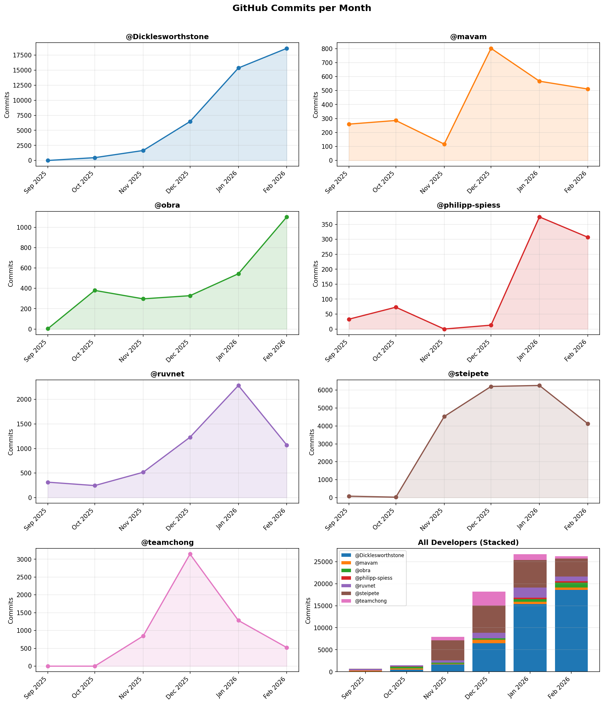

# What are they doing? A Commit-Level Dataset of Hyperactive AI-augmented Developers on GitHub 

This dataset captures the commit activity of a curated set of highly active, agentic software developers on GitHub. For each developer, it provides full commit metadata and daily commit counts spanning the months around the agentic coding explosion.

The goal of this dataset is to enable studies of AI-augmented software engineering behavior, agent adoption patterns, repository switching, commit quality, and temporal activity rhythms. The dataset currently covers 7 developers.


> **If you use this dataset, please cite it as below.**

```bibtex
@dataset{whataretheydoing2026,
  author    = {Thomas Degueule and Bernd Freisleben and Shane McIntosh and Martin Monperrus and Aaron Randrianaina and Romain Robbes},
  title     = {What are they doing? A Commit-Level Dataset of Hyperactive AI-augmented Developers on GitHub},
  howpublished     = {Dataset on Zenodo},
  year      = {2026},
  publisher = {Zenodo},
  doi       = {https://doi.org/10.5281/zenodo.18850301},
  url       = {https://github.com/tdegueul/what-are-they-doing}
}
```

This dataset has been produced at the Bellairs'26 Workshop on Continuous Software Engineering.

---

## Data Collection Methodology

Candidate developers are identified with the following sources:
- AI coding conversation on X/Twitter
- Github queries (see `script/find_agentic_ai_coders.py`)
- [Gitista](https://gitista.com/)
- [committers.top](https://committers.top/)
- [claudecount.com](https://www.claudecount.com) leaderboard of Claude Code usage, cross-referenced with GitHub profiles

Selection is then performed as a qualitative curation process by a team of expert software engineering researchers. We do not rely on a single automatic rule. Instead, we combine automated evidence with manual assessment of each candidate developer and their repositories.

Our inclusion workflow has four steps:

1. **Initial screening.** We use public activity signals and commit-volume queries to identify unusually active developers who may be using AI coding tools.
2. **Heuristic agent detection.** We inspect the developer's commits with the heuristics from [`agent-mining`](https://github.com/labri-progress/agent-mining), including co-author trailers, agent-related commit message patterns, and agent-specific files or configuration traces.
3. **Manual repository and commit review.** We read repository contents, inspect commit histories, and examine commit messages, temporal activity patterns, and bursts of work across repositories.
4. **Expert judgment.** When explicit agent traces are absent or incomplete, we rely on researcher judgment to decide whether a developer should still be considered AI-augmented. In those cases, the decision is based on the overall pattern of evidence, including message style, cadence, sustained commit frequency, and repository-level context.

In other words, the dataset is intentionally **curated rather than mechanically filtered**. Explicit agent signals strengthen the evidence, but they are not required in every included case. Some developers leave strong machine-readable traces; others are included because expert review indicates that their working style is consistent with AI-augmented software engineering.

## Covered Developers

| Handle | Analysis | One liner presentation |
|---|---|---|
| [steipete](https://github.com/steipete)  | [steipete.md](steipete.md) | The creator of Clawdbot/OpenClaw, extremely active and visible on social media about AI coding |
| [Dicklesworthstone](https://github.com/Dicklesworthstone) | [Dicklesworthstone.md](DICKLESWORTHSTONE.md)  | A developer with ~20(!) $200 [Claude Code Max](https://claude.com/pricing/max) subscriptions |
| [ruvnet](https://github.com/ruvnet)  | [ruvnet.md](ruvnet.md) | An independent consultant and developer harnessing the power of AI to build high-impact software (top of GitHub's trending repositories for at least 2 days) |
| [obra](https://github.com/obra)   |[obra.md](obra.md) | A developer who just started his own company and using AI to build software |
| [philipp-spiess](https://github.com/philipp-spiess)  | [philipp-spiess.md](philipp-spiess.md) | An open-source contributor, proud vibe-coder and AI agent enthusiast |
| [mavam](https://github.com/mavam) | [mavam.md](mavam.md) | A developer and CEO working on data pipelines for security operations using Claude for productivity |
| [teamchong](https://github.com/teamchong) | [teamchong.md](teamchong.md) | A developer with a super-human burst of commit productivity followed by a fall from grace |

### Candidate Developers Under Evaluation

The following developers are candidates identified during screening; data collection for this group is ongoing and they are not yet part of the main dataset.

| Handle | One liner presentation |
|---|---|
| [steveyegge](https://github.com/steveyegge) | Vibe-coded popular projects beads (issue tracking) and Gas Town (agent orchestration) |
| [kaptinlin](https://github.com/kaptinlin) | In the list of top Claude Code users with visible GitHub activity |
| [Dexploarer](https://github.com/Dexploarer) | Another top Claude Code user with visible GitHub activity |
| [haasonsaas](https://github.com/haasonsaas) | Top Claude Code user |

### False Positives

Notes about inspected developers who appeared to be agent-supported but did not meet our qualitative inspection criteria appear in markdown files in the [false positive](false-positive) directory.

## Dataset Statistics

### Overview
| Metric | Value |
| --- | --- |
| Observation window | 2025-09-01 to 2026-02-28 |
| Tracked repositories in dataset | 260 |
| Total commits from daily totals | 81,230 |
| Peak aggregate day | 2026-02-16 (1,833 commits) |
| Commit records with >=1 hard agent signal | 36,565 / 76,749 (47.6%) |
| Distinct detected agent labels | 8 |
| Most frequent detected agent | claude_code (36,493 commits) |

### Developer Coverage
| Developer | Month span | Tracked repos | Commits | Active days | Peak day | Agent commits | Agent % | Top agent |
| --- | --- | --- | --- | --- | --- | --- | --- | --- |
| Dicklesworthstone | 2025-09..2026-02 | 100 | 42,549 | 127 | 1,115 | 29,610 | 77.1% | claude_code |
| mavam | 2025-09..2026-02 | 21 | 2,543 | 154 | 88 | 981 | 38.6% | claude_code |
| obra | 2025-09..2026-02 | 36 | 2,656 | 116 | 202 | 1,388 | 52.3% | claude_code |
| philipp-spiess | 2025-09..2026-02 | 15 | 801 | 69 | 43 | 2 | 0.2% | opencode |
| ruvnet | 2025-09..2026-02 | 9 | 5,660 | 117 | 350 | 4,483 | 84.5% | claude_code |
| steipete | 2025-09..2026-02 | 71 | 21,222 | 130 | 630 | 65 | 0.3% | codex |
| teamchong | 2025-09..2026-02 | 10 | 5,799 | 108 | 295 | 36 | 0.6% | claude_code |

## Commits Over Time



Key findings from the figure:

- **Aggregate growth**: Total monthly commits across all developers grew from under 1,000 in Sep 2025 to over 26,000 by Jan–Feb 2026, reflecting a rapid ramp-up in AI-augmented activity over the observation window.
- **Divergent trajectories**: Developers follow distinct patterns rather than a uniform trend. Dicklesworthstone and obra show sustained monotonic growth; steipete and mavam plateau at a high level after an initial ramp; ruvnet peaks in Jan 2026 and then declines; philipp-spiess shows a sudden late adoption spike starting in Jan 2026.
- **Burst-and-collapse (teamchong)**: teamchong exhibits the sharpest burst-and-collapse pattern, peaking at ~3,100 commits in Dec 2025 before dropping to near-zero by Feb 2026 — consistent with their description as a developer with "a super-human burst of commit productivity followed by a fall from grace."


---


## Dataset Contents

```
developers.json                    # Developer registry with metadata and repo data/
  {developer}-{YYYY}-{MM}.json     # Daily commit data per developer per month
  commits/{sha}.json               # Cached per-commit file-level details
```

### Developer Registry (`developers.json`)

Each entry contains:
- `handle` — GitHub username
- `repos` — list of repositories committed to in the last 90 days

### Monthly Commit Files (`data/{developer}-{YYYY}-{MM}.json`)

Each file contains:
- `developer` — GitHub handle
- `month` — `YYYY-MM`
- `days` — dict keyed by date (`YYYY-MM-DD`), each value containing:
  - `total_count` — number of commits that day
  - `sampled` — number of commits with full metadata fetched
  - `commits` — list of raw GitHub API commit objects

---

## Scripts

All scripts live in `script/` and read a GitHub token from the system keyring
(`service="login2"`, `username="github_token"`).

The [`agent-mining`](https://github.com/labri-progress/agent-mining) repository is included as a submodule and provides the agent-detection heuristics used by `detect-agents.py`.

A GitHub personal access token with `repo` and `read:user` scopes is required, stored in the system keyring:

```python
import keyring
keyring.set_password("login2", "github_token", "<your-token>")
```

### Data Collection

| Script | Description |
|---|---|
| `collect-commits-per-day.py` | Collects all commits for a developer in a given month via the GitHub GraphQL API. Writes `data/{developer}-{YYYY-MM}.json`. Usage: `python script/collect-commits-per-day.py --developer steipete --month 2025-12` |
| `collect-commit-per-month.py` | Collects monthly commit counts for every developer in `developers.json` by iterating over their non-fork repos (avoids fork inflation). Writes results back to `developers.json`. |
| `list_repos_by_user_with_events.py` | Fetches all repos where a developer committed in the last 3 months via the GitHub GraphQL  API. |
| `collect-tentative-names.py` | Searches GitHub commits for `noreply@anthropic.com` to discover candidate AI-heavy users; filters by commit count and repo count. |

### Analysis

| Script | Description |
|---|---|
| `analyze-commits.py` | Analyses commit messages using Conventional Commits conventions (type breakdown, scopes, breaking changes). Usage: `python script/analyze-commits.py data/steipete-2025-12.json` |
| `analyze-commit-quality.py` | Scores commits as "good" or "dirty" by fetching changed files from the GitHub API and applying heuristics (focused vs scattered, test coupling, diff size, etc.). Commit details are cached in `data/commits/{sha}.json`. Usage: `python script/analyze-commit-quality.py data/steipete-2025-12.json` |
| `analyze-repo-switching.py` | Analyses how a developer switches between repositories over time (concentration, consecutive switches, bouncebacks, day-by-day timeline). Usage: `python script/analyze-repo-switching.py developers.json --author steipete --month 2025-12` |
| `visualize-file-touches.py` | Fetches per-commit file details and prints a terminal report covering file categories, change sizes, language hotspots, test/docs coupling, and engineering-signal heuristics. Usage: `python script/visualize-file-touches.py developers.json --author steipete --month 2025-12` |
| `detect-agents.py` | Detects which coding agents (Claude Code, Cursor, etc.) are used in a developer's commits via agent-mining heuristics (co-author trailers, message patterns, config files). Usage: `python script/detect-agents.py data/steipete-2025-12.json` |
| `histogram-commit-time.py` | Prints a horizontal bar chart of commit counts by UTC hour from a monthly data file. Usage: `python script/histogram-commit-time.py data/steipete-2025-12.json` |
| `plot-commits-over-time-separate.py` | Same chart with one subplot per developer. Saves to `data/commits-over-time-separate.png`. |

### Typical Workflow

```bash
# 1. Collect monthly commit data
python script/collect-commits-per-day.py --developer steipete --month 2025-12

# 2. Analyse the collected data
python script/analyze-commits.py        data/steipete-2025-12.json
python script/analyze-commit-quality.py data/steipete-2025-12.json
python script/detect-agents.py          data/steipete-2025-12.json
python script/histogram-commit-time.py  data/steipete-2025-12.json
python script/analyze-repo-switching.py developers.json --author steipete --month 2025-12
python script/visualize-file-touches.py developers.json --author steipete --month 2025-12

# 3. Visualise trends
python script/plot-commits-over-time-separate.py
```

---


## Related Work

- **[R1]** Robbes et al. (2026) present the first large-scale study (129,134 projects) of coding agent adoption on GitHub, finding an adoption rate of 15.85%–22.60% and that agent-assisted commits are larger and more feature/bugfix-oriented than human-only commits. They also release the `agent-mining` heuristics library used by this dataset's `detect-agents.py` script.

- **[R2]** Yu et al. (2024) study self-admitted LLM-generated code in GitHub projects with >5 stars: 229 projects and 696 snippets across five languages.

- **[R3]** Alam et al. (2026) analyze 8,106 fix-related PRs from five AI coding agents (AIDEV-POP dataset) to understand why AI-agent-involved PRs remain unmerged.

- **[R4]** Xu et al. (2025/2026) conduct a large-scale study of 20,000+ GitHub repositories linked to arXiv papers and identify measurable shifts in coding style (e.g., snake_case adoption, complexity, maintainability) attributable to LLM influence.

## References

[R1] Romain Robbes, Théo Matricon, Thomas Degueule, Andre Hora, and Stefano Zacchiroli.
*Agentic Much? Adoption of Coding Agents on GitHub.*
arXiv:2601.18341 [cs.SE], January 2026.
https://arxiv.org/abs/2601.18341 — Code/artifacts: https://github.com/labri-progress/agent-mining

[R2] Zhen Yu, Tao Zhang, Wentao Liao, and Jiaxin Zhu.
*Where Is Self-admitted Code Generated by Large Language Models on GitHub?*
In Proceedings of the 31st Asia-Pacific Software Engineering Conference (APSEC 2024), pp. 407–418. IEEE, 2024.

[R3] Khairul Alam, Saikat Mondal, and Banani Roy.
*Why Are AI Agent Involved Pull Requests (Fix-Related) Remain Unmerged? An Empirical Study.*
arXiv:2602.00164 [cs.SE], February 2026.
https://arxiv.org/abs/2602.00164

[R4] Yuliang Xu, Siming Huang, Mingmeng Geng, Yao Wan, Xuanhua Shi, and Dongping Chen.
*code_transformed: The Influence of Large Language Models on Code.*
In Findings of the Association for Computational Linguistics: EACL 2026.
arXiv:2506.12014 [cs.CL], June 2025 (revised February 2026).
https://arxiv.org/abs/2506.12014 — Code/data: https://github.com/ignorancex/LLM_code

---

## License

MIT

---

## Contact

Open an issue on the repository https://github.com/tdegueul/what-are-they-doing
